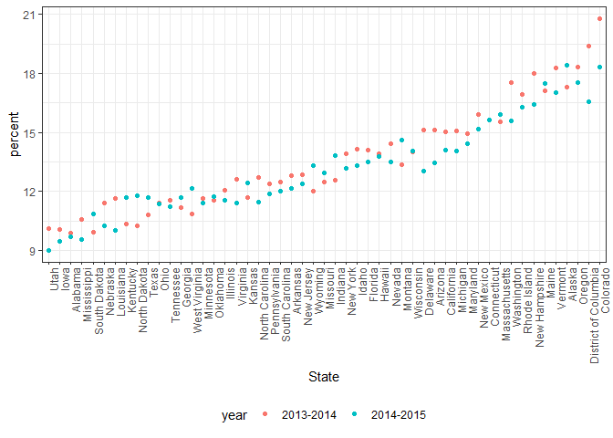
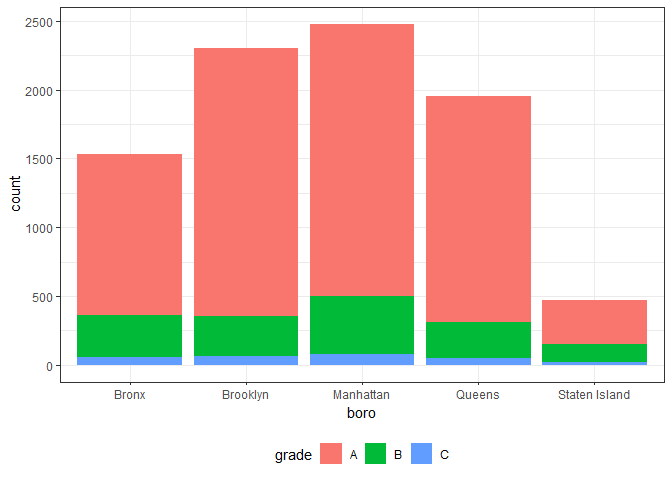
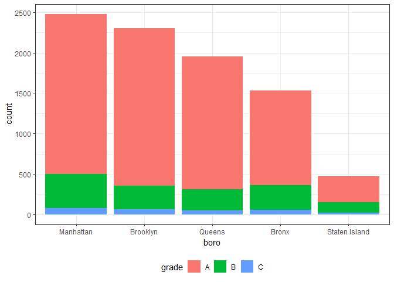
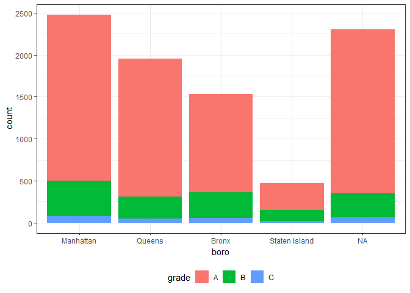

strings\_and\_factors
================
JiyueQin
October 13, 2018

Thoughts on factors
===================

``` r
vec_sex = factor(c("male", "male", "female", "female"))
as.numeric(vec_sex)
```

    ## [1] 2 2 1 1

``` r
vec_sex = relevel(vec_sex, ref = "male")
vec_sex
```

    ## [1] male   male   female female
    ## Levels: male female

``` r
as.numeric(vec_sex)
```

    ## [1] 1 1 2 2

``` r
pulse_data = haven::read_sas("./data/public_pulse_data.sas7bdat") %>%
  janitor::clean_names() %>%
  gather(key = visit, value = bdi, bdi_score_bl:bdi_score_12m) %>%
  mutate(visit = str_replace(visit, "bdi_score_", ""),
         visit = str_replace(visit, "bl", "00m"),
         visit = fct_relevel(visit, str_c(c("00", "01", "06", "12"), "m"))) %>%
  arrange(id, visit)
```

    ## Warning: attributes are not identical across measure variables;
    ## they will be dropped

NSDUH
=====

``` r
url = "http://samhda.s3-us-gov-west-1.amazonaws.com/s3fs-public/field-uploads/2k15StateFiles/NSDUHsaeShortTermCHG2015.htm"
drug_use_xml = read_html(url)

table_marj = (drug_use_xml %>% html_nodes(css = "table"))[[1]] %>%
  html_table() %>%
  .[-1,] %>%
  as_tibble()

data_marj = 
  table_marj %>%
  select(-contains("P Value")) %>%
  gather(key = key, value = percent, -State) %>%
  separate(key, into = c("age", "year"), sep = "\\(") %>%
  mutate(year = str_sub(year, 1, -2),
         percent = str_replace(percent, "[a-z]", ""),
         percent = as.numeric(percent)) %>%
  filter(!(State %in% c("Total U.S.", "Northeast", "Midwest", "South", "West")))

data_marj %>%
  filter(age == "12-17") %>% 
  mutate(State = fct_reorder(State, percent)) %>% 
  ggplot(aes(x = State, y = percent, color = year)) + 
    geom_point() + 
    theme(axis.text.x = element_text(angle = 90, hjust = 1))
```



Toothbrush reviews
==================

``` r
url_base = "https://www.amazon.com/Philips-Sonicare-rechargeable-toothbrush-HX6211/product-reviews/B00YAR7ZFM/ref=cm_cr_arp_d_viewopt_srt?ie=UTF8&reviewerType=all_reviews&sortBy=recent&pageNumber="

urls = str_c(url_base, 1:5)

read_html(urls[1]) %>% 
  html_nodes("#cm_cr-review_list .review-title") %>%
  html_text()
```

    ##  [1] "Phillips VS Oral-B"                  
    ##  [2] "Very good product"                   
    ##  [3] "Too hard bristles"                   
    ##  [4] "Fast shipping"                       
    ##  [5] "Not as powerful as some other models"
    ##  [6] "One year in use"                     
    ##  [7] "Holds a good charge"                 
    ##  [8] "Five Stars"                          
    ##  [9] "Terrible brush"                      
    ## [10] "great toothbrush!"

``` r
read_html(urls[2]) %>% 
  html_nodes("#cm_cr-review_list .review-title") %>%
  html_text()
```

    ##  [1] "Poor quality"                                                                    
    ##  [2] "BROKE AFTER 6 MONTHS."                                                           
    ##  [3] "Toothbrush"                                                                      
    ##  [4] "Poor ultrasonic toothbrush"                                                      
    ##  [5] "Five Stars"                                                                      
    ##  [6] "No bad surprises here"                                                           
    ##  [7] "Great!"                                                                          
    ##  [8] "Philips Sonicar 2 Series plaque control rechargeable electric toothbrush  Hx6211"
    ##  [9] "Great."                                                                          
    ## [10] "just valued as this price."

Biostat Methods I Example
=========================

``` r
ins1 = c(1.53, 1.61, 3.75, 2.89, 3.26)
ins2 = c(3.15, 3.96, 3.59, 1.89, 1.45, 1.56)
ins3 = c(3.89, 3.68, 5.70, 5.62, 5.79, 5.33)
ins4 = c(8.18, 5.64, 7.36, 5.33, 8.82, 5.26, 7.10)
ins5 = c(5.86, 5.46, 5.69, 6.49, 7.81, 9.03, 7.49, 8.98)

bmi_data = data_frame(
    insulin = c(ins1, ins2, ins3, ins4, ins5),
    ind = c(rep(1, length(ins1)),
                    rep(2, length(ins2)),
                    rep(3, length(ins3)),
                    rep(4, length(ins4)),
                    rep(5, length(ins5)))
)
bmi_data = bmi_data %>% 
  mutate(ind = factor(ind), 
         ind = fct_recode(ind,
                          "level_1" = "1",
                          "level_2" = "2",
                          "level_3" = "3",
                          "level_4" = "4",
                          "level_5" = "5")
         )

bmi_data %>% 
  lm(insulin ~ ind, data = .) %>% 
  broom::tidy() %>% 
  select(-std.error, -statistic) %>% 
  knitr::kable(digits = 3)
```

| term        |  estimate|  p.value|
|:------------|---------:|--------:|
| (Intercept) |     2.608|    0.000|
| indlevel\_2 |    -0.008|    0.992|
| indlevel\_3 |     2.394|    0.004|
| indlevel\_4 |     4.205|    0.000|
| indlevel\_5 |     4.493|    0.000|

``` r
bmi_data = bmi_data %>% 
  mutate(ind = fct_recode(ind,
                          "very_low"  = "level_1",
                          "low"       = "level_2",
                          "neutral"   = "level_3",
                          "high"      = "level_4",
                          "very_high" = "level_5"),
         ind = fct_relevel(ind, "neutral"))

bmi_data %>% 
  lm(insulin ~ ind, data = .) %>% 
  broom::tidy() %>% 
  select(-std.error, -statistic) %>% 
  knitr::kable(digits = 3)
```

| term          |  estimate|  p.value|
|:--------------|---------:|--------:|
| (Intercept)   |     5.002|    0.000|
| indvery\_low  |    -2.394|    0.004|
| indlow        |    -2.402|    0.002|
| indhigh       |     1.811|    0.014|
| indvery\_high |     2.100|    0.004|

Restaurant inspections
======================

``` r
nyc_inspections = read_csv("./data/DOHMH_New_York_City_Restaurant_Inspection_Results.csv.gz", 
                           col_types = cols(building = col_character()),
                           na = c("NA", "N/A"))

nyc_inspections %>% 
  group_by(boro, grade) %>% 
  summarize(n = n()) %>% 
  spread(key = grade, value = n)
```

    ## # A tibble: 6 x 8
    ## # Groups:   boro [6]
    ##   boro              A     B     C `Not Yet Graded`     P     Z `<NA>`
    ##   <chr>         <int> <int> <int>            <int> <int> <int>  <int>
    ## 1 BRONX         13688  2801   701              200   163   351  16833
    ## 2 BROOKLYN      37449  6651  1684              702   416   977  51930
    ## 3 MANHATTAN     61608 10532  2689              765   508  1237  80615
    ## 4 Missing           4    NA    NA               NA    NA    NA     13
    ## 5 QUEENS        35952  6492  1593              604   331   913  45816
    ## 6 STATEN ISLAND  5215   933   207               85    47   149   6730

``` r
# this spread after summary is useful

nyc_inspections =
  nyc_inspections %>%
  filter(grade %in% c("A", "B", "C"), boro != "Missing") %>% 
  mutate(boro = str_to_title(boro))

nyc_inspections %>% 
  filter(str_detect(dba, "Pizza")) %>% 
  group_by(boro, grade) %>% 
  summarize(n = n()) %>% 
  spread(key = grade, value = n)
```

    ## # A tibble: 5 x 3
    ## # Groups:   boro [5]
    ##   boro              A     B
    ##   <chr>         <int> <int>
    ## 1 Bronx             9     3
    ## 2 Brooklyn          6    NA
    ## 3 Manhattan        26     8
    ## 4 Queens           17    NA
    ## 5 Staten Island     5    NA

``` r
# str_detect is case sensitive
nyc_inspections %>% 
  filter(str_detect(dba, regex("pizza", ignore_case = TRUE))) %>% 
  group_by(boro, grade) %>% 
  summarize(n = n()) %>% 
  spread(key = grade, value = n)
```

    ## # A tibble: 5 x 4
    ## # Groups:   boro [5]
    ##   boro              A     B     C
    ##   <chr>         <int> <int> <int>
    ## 1 Bronx          1170   305    56
    ## 2 Brooklyn       1948   296    61
    ## 3 Manhattan      1983   420    76
    ## 4 Queens         1647   259    48
    ## 5 Staten Island   323   127    21

``` r
nyc_inspections %>% 
  filter(str_detect(dba, regex("pizza", ignore_case = TRUE))) %>%
  ggplot(aes(x = boro, fill = grade)) + geom_bar()
```



``` r
nyc_inspections %>% 
  filter(str_detect(dba, regex("pizza", ignore_case = TRUE))) %>%
  mutate(boro = fct_infreq(boro)) %>%
  ggplot(aes(x = boro, fill = grade)) + geom_bar()
```



``` r
nyc_inspections %>% 
  filter(str_detect(dba, regex("pizza", ignore_case = TRUE))) %>%
  mutate(boro = fct_infreq(boro),
         boro = replace(boro, which(boro == "Brooklyn"), "Hipsterville")) %>%
  ggplot(aes(x = boro, fill = grade)) + geom_bar()
```

    ## Warning in `[<-.factor`(`*tmp*`, list, value = "Hipsterville"): invalid
    ## factor level, NA generated



``` r
nyc_inspections %>% 
  filter(str_detect(dba, regex("pizza", ignore_case = TRUE))) %>%
  mutate(boro = fct_infreq(boro),
         boro = fct_recode(boro, "Hipsterville" = "Brooklyn")) %>%
  ggplot(aes(x = boro, fill = grade)) + geom_bar()
```


